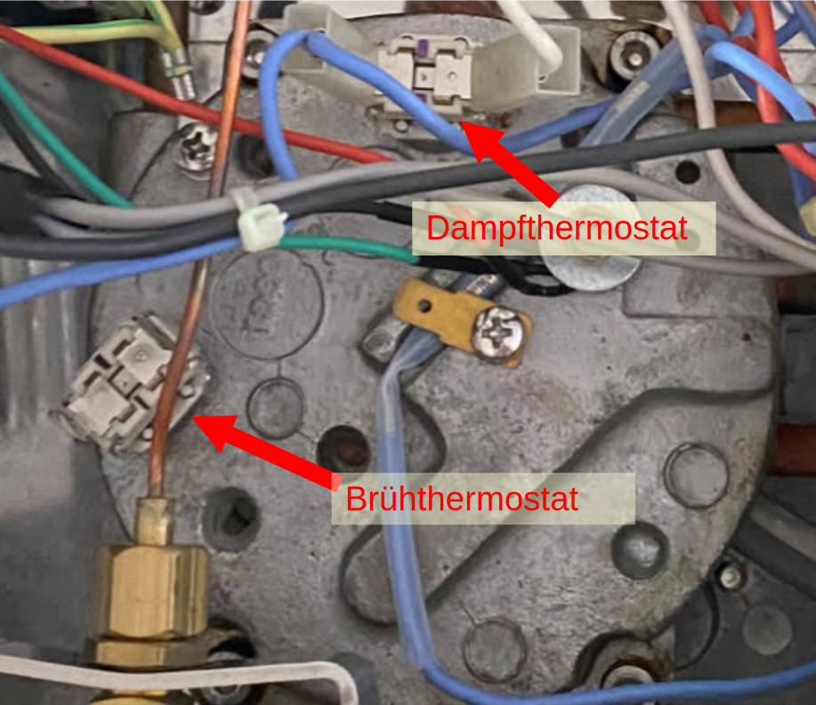
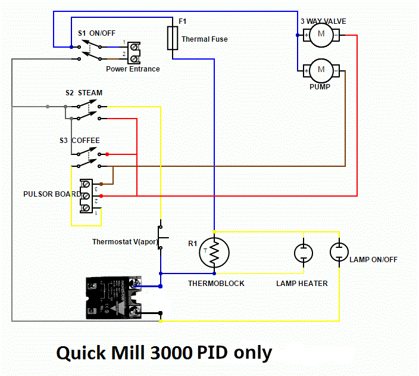
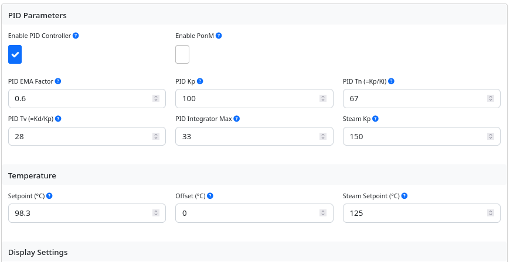
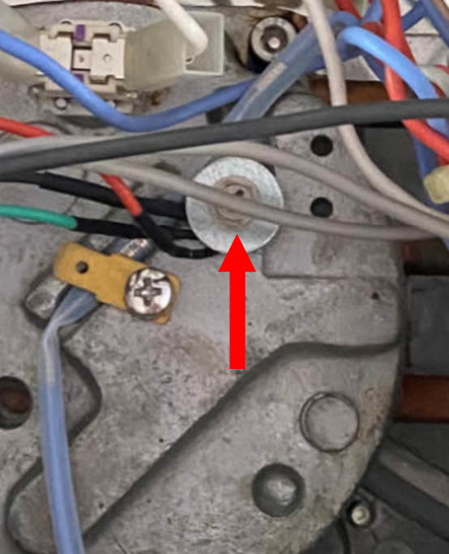

# Thermoblock - Anpassungen
{: .no_toc }

Inhaltsverzeichnis

* TOC
{:toc}

## Einleitung

Die PID lässt sich auch zur Steuerung von Thermoblock Maschinen einsetzen. Je nach Aufbau der Maschine muss die Steuerung angepasst werden. Details zu bereits erfolgten Umbauten und den in der PID umgesetzten Features werden im Folgenden beschrieben. 

## Hinweis

Jede Beschreibung dient nur der Orientierung und jeglicher Umbau erfolgt auf eigene Gefahr. Es ist möglich, dass die Maschine im Rahmen der Arbeiten irreparabel beschädigt wird (Verpolung, Kurzschluss etc.).
Bei unsachgemäßer Handhabung oder mangelhaften Vorsichtsmaßnahmen besteht Verletzungsgefahr, zudem kann es bei Arbeiten unter Spannung zu lebensgefährlichen Stromschlägen kommen.
**IMMER DAS GERÄT PHYSISCH VOM STROMNETZ TRENNEN** (also Kabel aus der Steckdose und idealerweise auch aus dem Gerät, in dieser Reihenfolge)

## 1. Quick Mill Thermoblock Maschinen

### 1.1 Modelle
Aktuell lassen sich mit der PID die **Quick Mill 0820 (Stretta)**, die **Quick Mill 0835 (Retrò)** und die **Quick Mill 3000 (Orione)** steuern. Der Aufbau der drei Maschinen ist sehr ähnlich. Sie haben alle einen Thermoblock, der sowohl für den Bezug als auch für die Erzeugung von Dampf verwendet wird. 

### 1.2 Umbauvariante(n)
Es gibt derzeit nur für „PID only“ eine „fertige“ Umbauanleitung, wobei einzelne User an einem Vollausbau arbeiten, siehe Diskussion im entsprechenden Tread unter Support-Hardware im Discord-Chat. Das Hauptproblem beim Vollausbau ist die Dampferzeugung, die anders als bei Kessel-Maschinen eine pulsierende Pumpen-Aktivität erfordert, was die Steuerung komplizierter macht.
Die früher beschriebene automatische Brüh-/Dampferkennung mit Einbau eines Optokopplers („PID+“) wird nicht mehr unterstützt.

#### PID only
Die Temperatursteuerung wird vom PID-Modul übernommen, die Ansteuerung der Heizung erfolgt hierbei über das Schaltmodul (SSR). Hierfür wird der „Kaffee“-Thermostat ausgesteckt und durch den SSR ersetzt (siehe Schaltplan unten). Dass die Steuerung aktiv ist, sieht man nach dem Umbau am unregelmäßigen Blinken des orangenen Kontroll-Lämpchens.

#### Dampfmodus
Um zu schäumen, muss manuell die Temperatursteuerung auf Dampfmodus umgestellt werden. Das kann entweder über das Web-Portal, oder über einen MQTT-Befehl (z.B. Taster über Homeassistant) erfolgen. Oder man baut einen Taster in das Gerät ein, der direkt an „STEAM und 3,3V auf dem PCB angeklemmt wird. Denkbar wäre z.B. ein kleiner Edelstahl Klingeltaster, für den man allerdings (vorsichtig) ein Loch in das Gehäuse bohren muss. Einstellungen in der Hardware-Config: „Momentary“ und „normally open“.
Anschließend kann wie im Originalzustand über den Dampf-Schalter Dampf bezogen werden.

**Wichtig:** Bei dieser Umbauvariante bleibt - wie auf dem Schaltplan zu sehen - bei den Thermoblock-Maschinen der Dampf-Thermostat angeklemmt, was dazu führt, dass beim Aktivieren des (originalen) Dampf-Schalters der Maschine unabhängig vom aktuellen Modus der PID-Steuerung die Heizung bis 120°C (Zieltemperatur des Original-Thermostats) heizt (sieht man am durchgehend leutenden orangenen Kontroll-Lämpchen). Somit bleibt die ursprüngliche Dampffunktion in jedem Fall erhalten und man könnte sie einfach weiter nutzen.
Der PID-Dampfmodus hat den Vorteil, dass man mit ein paar Grad mehr auch mehr Dampf erzeugt und die Temperatur nicht erst langsam ansteigt, während die Pumpe schon aktiv ist, sondern man diese erst bei Erreichen der Zieltemperatur aktiviert.

### 1.3 Schaltpläne

#### Originalzustand
Der folgende Schaltplan [Quelle](https://www.koffiepraat.nl/forum/download/file.php?id=3718&sid=347497ff32b0a1b68d92d8acab0887d5&mode=view) zeigt die Verschaltung der Quick Mill 3000. Der Schaltplan ist auch für die Modelle 0820 und 0835 repräsentativ. Bei dem Modell 0835 kommt zusätzlich noch die Steuerung der integrierten Mühle dazu, die aber unabhängig von dem hier dargestellten Schaltplan ist und darauf keinen Einfluss hat. 

Nicht im Detail dargestellt ist die Steuerung der Pumpe (Pulsor Board). Eine verbale Beschreibung findet man in dem [Thread "Schaltplan Quickmill Orione 3000" im Kaffee-Netz](https://www.kaffee-netz.de/threads/schaltplan-quickmill-orione-3000.137528/#post-1940051). 

Kurz zusammengefasst, wird die Pumpe auf zwei Wegen mit Strom versorgt:  
* **Bezugsmodus:** Über den geschlossenen Bezugsschalter (S3 Coffee) fließt der Strom in Pin 2, direkt weiter zu Pin 1 und dann wieder durch den Bezugsschalter in die Pumpe. 
* **Dampfmodus:** Über den geschlossenen Dampfschalter (S2 Steam) fließt der Strom in Pin 2. Das Board gibt über Pin 3 einen pulsierenden Strom an die Pumpe ab, so dass immer nur ein wenig Wasser in den Thermoblock gelangt und dort verdampft wird.

#### PID Only
In dem folgenden Schaltplan sieht man die Verschaltung für die Ausbaustufe PID Only. Der Kaffee-Thermostat ist durch das SSR ersetzt. 

### 1.4 Hinweise zum Einbau

#### Temperatursensor
Über die optimale Positionierung des Temperatursensors gibt es unterschiedliche Ansichten.
Die Anbringung nahe der Schmelzsicherung (ohne Kleber oder Paste, s. Bild) hat mit folgenden Einstellungen gut funktioniert:

Die **Zieltemperatur** ist individuell anzupassen und entspricht natürlich nicht dem, was im Sieb ankommt. Am besten fängt man mit einem Wert um 99°C an und „tastet“ sich nach oben/unten vor („taste“ im Sinn von schmecken). Alles andere (Messungen im Sieb etc.) vergeudet nur Zeit und Ressourcen (kann aber je nach persönlichen Vorlieben ein Zeitvertreib sein).

#### Stromversorgung Steuerung
Für die Stromversorgung wird ein 5V Netzteil benötigt (siehe Bauplan). Die 230V kann man z.B. an der On/Off-Lampe abgreifen.

#### Display
Das Display kann man mit einem kleinen Gehäuse oben auf der Ablage platzieren (dünnes Flachband-Kabel passt zwischen Abdeckung und Gehäuse), oder man schneidet ein Loch in seine Maschine und baut einen hübschen Rahmen ein (je nach Mut und eigenen Fertigkeiten).

#### Wo kommt der Rest hin?
Zum Beispiel (alles innen):
* Netzteil rechts
* PCB neben das Netzteil oder an die Rückwand
* links das SSR-Modul (230V Kabel kürzer)

ACHTUNG 230V!! Unbedingt die Schraub-Kontakte mit einer Schutzabdeckung versehen, z.B. kann man [diese von findie](https://www.thingiverse.com/thing:6277388) selbst drucken.

Jede Anordnung hat Vor- und Nachteile, so dass man am besten zunächst alle Teile einmal lose positioniert und erst verkabelt, wenn man mit seinem Setup zufrieden ist.
Am besten verwendet man für das SSR Modul ein wärmeleitendes Klebepad. Hilfreich sind auch selbstklebende Kabelclips, um die Leitungen am Gehäuse zu befestigen.

