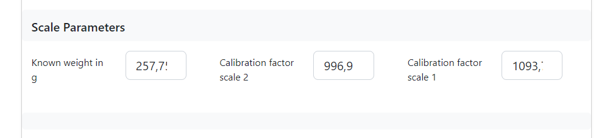
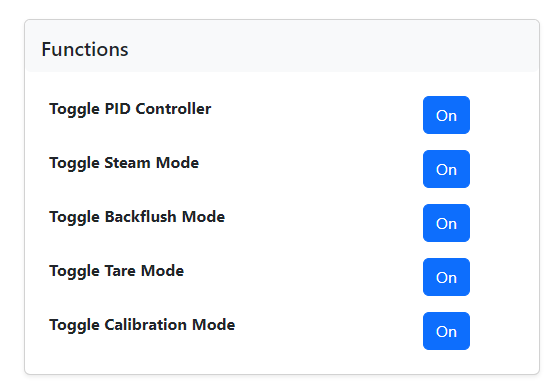

# Aufbau und Einbau der Waage
{: .no_toc }

Inhaltsverzeichnis

* TOC
{:toc}

## Einführung

Für den Vollausbau besteht die Möglichkeit der Ergänzung einer Waage für den Bezug nach Gewicht (Stopp bei Zielgewicht).
Der Grundaufbau entspricht dabei bekannter Waagen mit einer Wägezelle. Diese wird mittels eines HX711 an den Arduino angeschlossen.

In den meisten Maschinen bietet es sich an, je eine Wägezelle links und rechts unter der Abtropfschale zu verbauen.
Es gibt grundsätzlich die Möglichkeit, beide Zellen an einem einzelnen HX711 anzuschließen. Bei diesem Aufbau wurde in der Vergangenheit über mangelhafte Genauigkeit und eine große Abhängigkeit des gemessenen Gewichts von der Tassenposition auf dem Abtropfgitter berichtet. 

Es empfiehlt sich daher, für jede Wägezelle einen separaten HX711 anzuschließen. Der Vorteil liegt darin, dass beide Zellen dann unabhängig voneinander kalibriert werden können. 

## Der Hardware-Aufbau

Ihr benötigt zwei Wäägezellen mit einer ausreichend genauen Auflösung (0,1gr) und ausreichend Tragkraft (also größer Gewicht Abtropfschale + Lieblingstasse). 500g pro Zelle sollten ausreichen, 1kg pro Zelle ist in der Regel online leichter zu finden. 
Aktuell sind folgende Zellen die meistverbauten: [Link] (https://amzn.to/2RWJnKs)

Um die Zellen am Gehäuse zu montieren gibt es eine Adapter-Lösung zum Klemmen, und eine zum Schieben, für den 3D-Drucker. 
Eine Auswahl auf  und  (Empfehlung, sehr flaches Design). Weitere Infos und Erfahrungsberichte findet ihr auf Discord im 3D-Printing-Channel. 

Anschließend verbindet ihr die Zellen mit dem/den HX711 und diese(n) mit den Pins am ESP32:

```
#define PIN_HXDAT 32            // Brew scale data pin 1
#define PIN_HXDAT2 25           // Brew scale data pin 2
#define PIN_HXCLK 33            // Brew scale clock pin
```

Falls ihr zwei HX711 verbaut, teilen sich beide den CLK-Pin! Da die Software beide Zellen sequentiell und nicht parallel ausliest funktioniert das ohne Probleme.

Ein altes Bild vom Einbau mit nur einem HX711:


## Software

Zunächst müsst ihr die Software für die Verwendung der Waage konfigurieren: 

```
// PID & Hardware
#define ONLYPIDSCALE 1             // 0 = off , 1 = OnlyPID with Scale
```

Danach muss die Waage kalibriert werden. Die Kalibrierung ist mittlerweile über die Website möglich.  
Haltet dazu ein Kalibriergewicht parat, bei welchem euch das Gewicht bekannt ist. Das Gewicht sollte mindestens 25% der Kapazität eurer Waage betragen (also mind. 250g bei 1kg maximaler Belastung).

Öffnet die Website und wechselt in den Parameter-Tab. Ganz unten findet ihr die Konfiguration für die Waage: 



Tragt hier das Gewicht eures Kalibriergewichts ein. Den/Die Kalibrierungsfaktor(en) könnt ihr ignorieren. Diese Werte werden während der Kalibrierung überschrieben. 

Wechselt dann auf die Startseite und klickt bei "Toggle Scale Calibration Mode" auf "on":



Das Display der Maschine führt euch dann durch den Kalibrierungsprozess. Falls ihr zwei HX711 angeschlossen habt, wird zuerst der an `PIN_HXDAT` und dann der an `PIN_HXDAT2` kalibriert.

Für die Kalibrierung das Abtropfgitter abnehmen und das Gewicht auf der Wägezelle balancieren. 

## Shot nach Zielgewicht

Wenn ihr neben dem PID auch die Steuerung der Pumpe via CleverCoffee eingebaut habt, könnt ihr nun, neben dem Bezug nach Zeit, auch den Bezug nach Gewicht einstellen.

```
// PID & Hardware
#define BREWMODE 2                 // 1 = Brew by time (with preinfusion); 2 = Brew by weight (from scale)
```

Anschließend könnt ihr auf der Website das Zielgewicht einstellen. Beim Bezug nach Gewicht wird die Bezugsdauer zwar gemessen und angezeigt, der Shot endet aber erst dann, wenn das Zielgewicht erreicht ist. 
