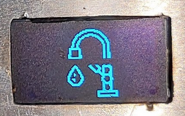
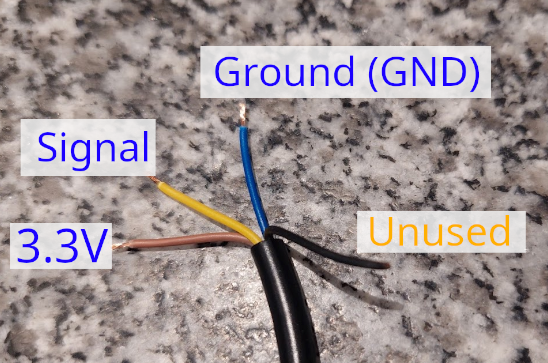
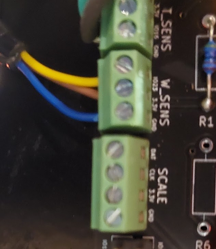
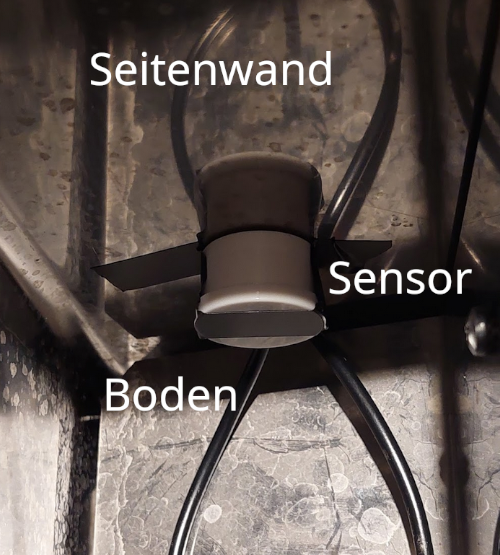
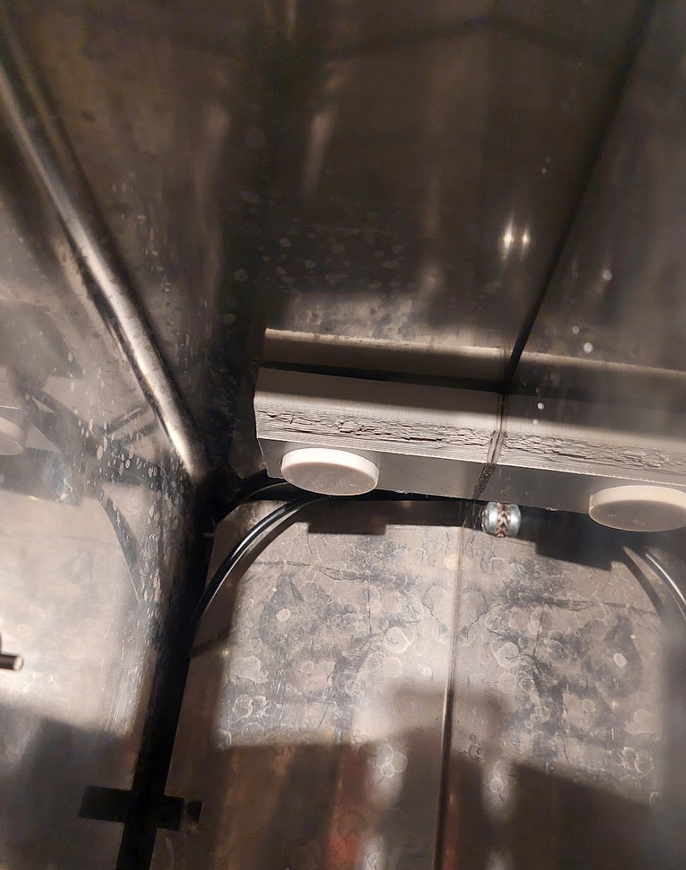

# Einbau eines Wasserstandssensors
{: .no_toc }

Inhaltsverzeichnis

* TOC
{:toc}

## Einführung
Ab Version 4.0.0 wird der Einbau eines Wasserstandssensors unterstützt, der kontaktlos den Wasserstand im Kunststofftank der Maschine 
erfassen kann. Dabei wird nicht die Restmenge erfasst, sondern ob auf der Einbauhöhe des Sensors Wasser ist ("ja") oder nicht ("nein").

Es werden aktuell zwei Sensortypen standardmäßig von der Software unterstützt:
* [Xkx-Y25-Npn](https://www.amazon.de/Xkc-Y25-Npn-Fl%C3%BCssigkeitsstandsensor-Ber%C3%BChrungsloser-Wasserstandsmelder-Ausgangsschnittstelle/dp/B088PGKPJ4)
* [Xkx-Y25-Pnp](https://www.amazon.de/Wasserdichter-ber%C3%BChrungsloser-Fl%C3%BCssigkeitsstandssensor-Schalter-Signalausgang/dp/B074NVLTW6)

Detektiert der Sensor im Betrieb der Maschine kein Wasser mehr, erscheint ein Symbol auf dem Display und der PID wird deaktiviert
(== es erfolgt kein Heizvorgang mehr). Ein laufender Espresso-Bezug wird nicht unterbrochen.




## Einbau
**Die folgende Einbauanleitung beschreibt den Einbau in einer Rancilio Silvia. Für andere Modelle sollte vorher überprüft werden, ob der Einbau am Tank entsprechend möglich ist.**

Der Einbau ist sehr einfach und erfordert keine weiteren Lötarbeiten. Für den Einbau kann eine 3D-gedruckte Halterung (siehe [hier](https://www.thingiverse.com/thing:6340201)) verwendet werden. Alternativ kann der Sensor auch mit (Doppel)Klebeband direkt ans Gehäuse geklebt werden.

### Vorbereitung
Den Anschlussstecker am Sensor entfernen und das gelbe, braune und blaue Kabel abisolieren. Das schwarze Kabel wird nicht verwendet und kann z.B. mit einem Isolierklebeband ans Kabel geklebt werden.

### Anschluss
Die Kabel haben folgende Funktion:
* Gelb: Signal (je nach PCB-Revision, z.B. V1.3 Pin 1023)
* Blau: Ground (GND)
* Braun: Stromversorgung (3.3V)



Am PCB wird der Wasserstandssensor entsprechend der Beschreibung bei W_SENS angeschlossen.



### Platzierung des Sensors
Der Sensor hat eine Reichweite von etwa 20mm (Herstellerangabe), d.h. er sollte möglichst nah am Wassertank angebracht werden. Bei der Rancilio Silvia funktioniert der Sensor, wenn er einfach an die Seitenwand geklebt wird. 

Die **Einbauhöhe** des Sensors sollte so gewählt werden, dass zum Zeitpunkt der Wasserstandswarnung noch genügung Wasser im Tank ist, um einen eventuell laufenden Espressobezug zu beenden. 




### Konfiguration in der Firmware
Der Sensor muss in der Firmware noch aktiviert werden. Hierfür in der Datei `userConfig.h` die folgende Einträge suchen und anpassen:

```c
// PID & Hardware
...
#define FEATURE_WATER_SENS 1       // 0 = deactivated, 1 = activated
#define WATER_SENS_TYPE 0          // 0 = water sensor XKC-Y25-NPN connected, 1 = XKC-Y25-PNP connected
```
**Wichtig**: Den Wert für `WATER_SENS_TYPE` auf den korrekten Wert für den verwendetem Sensortyp (NPN oder PNP) stellen.

Danach die Firmware auf den ESP flashen ("Upload") und der Wasserstandssensor sollte funktionieren.

## Troubleshooting
Bei Problemen mit dem Sensor einmal den angeschlossenen und aktivierten Sensor "manuell" testen: Direkt an den gefüllten Tank (oder ein anderes Kunststoffgefäß mit Wasser) halten und überprüfen, ob der richtige Zustand im Display angezeigt wird.

1. Tank enthält Wasser: Normale Anzeige / Maschine heizt
2. Tank enthält kein Wasser: Anzeige "Wasserhahn"-Symbol und Maschine heizt nicht.

Funktioniert dies nicht, sollten die Anschlüsse am PCB sowie die Konfiguration in der Software überprüft werden. 

Funktioniert der manuelle Test, ist möglicherweise der Einbauort des Sensors falsch und der Sensor muss näher an die Tankwand montiert werden.