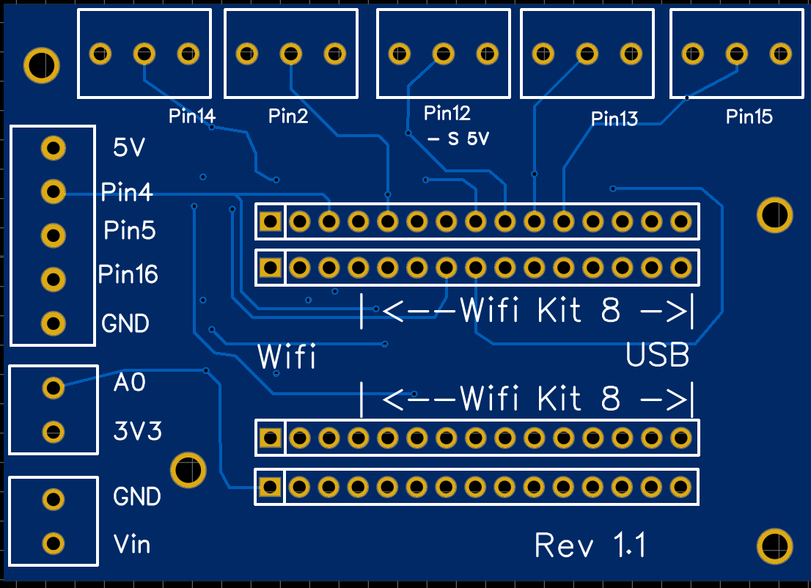

{: .no_toc }

Inhaltsverzeichnis

* TOC
{:toc}

## ESP8266 Platine

Das PCB für den (älteren) Mikrocontroller ESP8266 sieht wie folgt aus:

###  PIN Belegung vom PCB ESP8266

Die einzelnen Komponenten werden wie folgt angeschlossen:

Pin|Funktion
-|-
Pin 15| Bezugsschalter oder Optokoppler
Pin 14| SSR Heizung 
Pin 2| Temperatursensor
A0| Drucksensor
Pin 4| Display SDA
Pin 5| Display SCL
Pin 16| E-Trigger Standby Trigger Silvia E

### Vollausbau

Bei dem „Vollausbau“ wird noch die Steuerung für Magnetventil und Pumpe benötigt:

PIN | Belegung
-|-
PIN 12 | Relais Ansteuerung Magnetventil
PIN 13 | Relais Ansteuerung Pumpe
