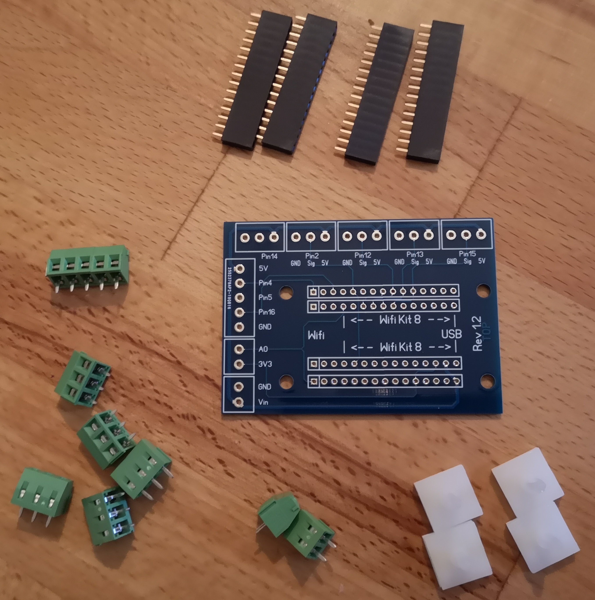

# Bill Of Material
{: .no_toc }

Contents

* TOC
{:toc}

## Warning

> {{ site.warning.en }}

## The List

You'll need the following things:
(A few of them might already lay in some random drawers)

### Basics

Those are the parts that you will definitely need, and which might (usually) not randomly lay around in a workshop.
Values in brackets indicate the minimum amount.
The controller to use (ESP8266 or ESP32) depends on which base board you ordered.

| Description | ID | Amount PID Only | Amount Full Expansion | Link |
| --- | --- | --- | --- | --- |
| Temperature Sensor | TSIC 306 TO92 | 2 (1) | 2 (1) | [Reichelt-Link](https://www.reichelt.de/tsic-digitale-halbleiter-temperatursensoren-tsic-306-to92-p82327.html), [Alternative Shop](https://shop.bb-sensors.com/Messtechnik-je-Branche/Gebaeudetechnik/Digitaler-TSic-306-Temperatursensor-TO92.html), [Alternative Sensor](https://www.reichelt.de/de/de/tsic-digitale-halbleiter-temperatursensoren-tsic-206-to92-p82326.html) |
| Switching Power Supply | APV-8-5 | 1 | 1 | [Reichelt-Link](https://www.reichelt.de/led-trafo-7-w-5-v-dc-1400-ma-mw-apv-8-5-p170873.html) or [Amazon-Link](https://www.amazon.de/gp/product/B06Y29GSHH/) |
| SSR Relais – Heating | RA 2425-D06 | 1 | 1 | [Reichelt-Link](https://www.reichelt.de/solid-state-relais-ust-2-32vdc-ulast-24-280v-ra-2425-d06-p22691.html) |
| Mikrocontroller | NodeMCU V2 ESP8266 OR ESP32 (depending on base board) | 1 | 1 | ESP8266: [Amazon-Link](https://www.amazon.de/AZDelivery-NodeMCU-ESP8266-ESP-12E-Development/dp/B06Y1LZLLY) or [Ebay-Link](https://www.ebay.de/itm/NodeMCU-v3-2-ESP8266-Dev-Kit-WIFI-Lolin-Amica-CP2102-v2-Arduino-IOT/252712258856) or [unsoldered (Amazon)](https://www.amazon.de/-/en/AZDelivery-NodeMCU-Amica-Unsoldered-Parent/dp/B07GYW4T5F) OR ESP32 V4: [ESP32 Dev Kit C V4](https://www.amazon.de/-/en/AZDelivery-Development-Compatible-Including-Successor/dp/B07Z83MF5W) |
| Display (optional, but recommended) | 128 x 64 Pixel OLED SSD1306 | 1 | 1 | [Amazon-Link](https://www.amazon.de/AZDelivery-Display-Arduino-Raspberry-gratis/dp/B01L9GC470) |
| our base board | PCB | 1 | 1 | see below |

### Cables

#### Heat-Resistant Cables

Heat-resistant cables for wiring near to the boiler.

| Description | ID | Amount PID Only | Amount Full Expansion | Link |
| --- | --- | --- | --- | --- |
| High Temperature Wire ÖLFLEX® HEAT 180 SIF 1 x 1.50 mm², black | 601382 | 2 | 2 | [Link](https://www.conrad.de/de/p/lapp-0051001-hochtemperaturader-oelflex-heat-180-sif-1-x-1-50-mm-schwarz-meterware-601382.html) |
| High Temperature Wire ÖLFLEX® HEAT 180 SIF 1 x 1.50 mm², blue | 600368 | 2 | 2 | [Link](https://www.conrad.de/de/p/lapp-0051002-hochtemperaturader-oelflex-heat-180-sif-1-x-1-50-mm-blau-meterware-600368.html) |
| High Temperature Wire ÖLFLEX® HEAT 180 SIF 1 x 0.25 mm², black | 604025 | 2 | 2 | [Link](https://www.conrad.de/de/p/lapp-0047001-hochtemperaturader-oelflex-heat-180-sif-1-x-0-25-mm-schwarz-meterware-604025.html) |
| High Temperature Wire ÖLFLEX® HEAT 180 SIF 1 x 0.25 mm², red | 603963 | 2 | 2 | [Link](https://www.conrad.de/de/p/lapp-0047104-hochtemperaturader-oelflex-heat-180-sif-1-x-0-25-mm-rot-meterware-603963.html) |
| High Temperature Wire ÖLFLEX® HEAT 180 SIF 1 x 0.25 mm², green | 609459 | 2 | 2 | [Link](https://www.conrad.de/de/p/lapp-0047006-hochtemperaturader-oelflex-heat-180-sif-1-x-0-25-mm-gruen-meterware-609459.html) |
| High Temperature Wire ÖLFLEX® HEAT 180 SIF 1 x 0.25 mm², yellow | 602330 | 2 | 2 | [Link](https://www.conrad.de/de/p/lapp-0047005-hochtemperaturader-oelflex-heat-180-sif-1-x-0-25-mm-gelb-meterware-602330.html) |

#### Normal Cables

Normal cables. Not recommended, but still usable when kept away far enough from hot components.

| Description | ID | Amount PID Only | Amount Full Expansion | Link |
| --- | --- | --- | --- | --- |
| Stranded Hook-Up Wire H07V-K, 1,5 mm, 10 m, blue | H07VK 1,5-10BL | 1 | 1 | [Link](https://www.reichelt.de/schaltlitze-h07v-k-1-5-mm-10-m-blau-h07vk-1-5-10bl-p69504.html) |
| Stranded Hook-Up Wire H07V-K, 1,5 mm, 10 m, black | H07VK 1,5-10SW | 1 | 1 | [Link](https://www.reichelt.de/schaltlitze-h07v-k-1-5-mm-10-m-schwarz-h07vk-1-5-10sw-p69503.html) |
| Copper Stranded Hook-Up Wire isolated, 10 m, 1×0,14mm², black | LITZE SW | 1 | 1 | [Link](https://www.reichelt.de/kupferlitze-isoliert-10-m-1-x-0-14-mm-schwarz-litze-sw-p10298.html) |
| Copper Stranded Hook-Up Wire isolated, 10 m, 1×0,14mm², blue | LITZE BL | 1 | 1 |[Link](https://www.reichelt.de/kupferlitze-isoliert-10-m-1-x-0-14-mm-blau-litze-bl-p10292.html) |
| Copper Stranded Hook-Up Wire isolated, 10 m, 1×0,14mm², red | LITZE RT | 1 | 1 | [Link](https://www.reichelt.de/kupferlitze-isoliert-10-m-1-x-0-14-mm-rot-litze-rt-p10297.html) |
| Copper Stranded Hook-Up Wire isolated, 10 m, 1×0,14mm², green | LITZE GN | 1 | 1 | [Link](https://www.reichelt.de/kupferlitze-isoliert-10-m-1-x-0-14-mm-gruen-litze-gn-p10296.html) |

### Accessories

Those accessories are definitely recommended. You might already have one or the other in your workshop.

| Description | ID | Amount PID Only | Amount Full Expansion | Link |
| --- | --- | --- | --- | --- |
| Piggy back disconnects with shrinking tube – 1,5 … 2,5 mm² | WE F602638HS | 10 | 20 | [Reichelt-Link](https://www.reichelt.de/de/en/female-disconnects-with-shrinking-tube-we-f602638hs-p189402.html) |
| Piggy back disconnects with shrinking tube - 1,5-2,5 mm² | WE F606638.1N | 5 | 5 | [Reichelt-Link](https://www.reichelt.de/de/en/piggy-back-disconnects-nylon-transp--we-f606638-1n-p189372.html) |
| Piggy Back disconnects with shrinking tube - 1,5-2,5 mm² | WE F616638HS | 10 | 20 | [Reichelt-Link](https://www.reichelt.de/de/en/female-disconnects-with-shrinking-tube-we-f616638hs-p189408.html) |
| Ring connector for M3, red | RK-R-3 | 10 | 10 | [Reichelt-Link](https://www.reichelt.de/de/en/ring-connector-for-m3-red-rk-r-3-p15259.html) |
| Ring connector for M5, red | RK-R-5 | 10 | 10 | [Reichelt-Link](https://www.reichelt.de/de/en/ring-connector-for-m5-red-rk-r-5-p142770.html) |
| Relay for **Full Expansion** (see below) | DEBO RELAY 4WAY | 0 | 1 | [Reichelt-Link](https://www.reichelt.de/de/en/developer-boards-4-way-solid-state-relay-5v-240v-2a-debo-relay-4way-p280064.html) |
| Heat-shrink tubing assortment, black, 100 pieces | DELOCK 86271 | 1 | 1 | [Link](https://www.reichelt.de/de/en/heat-shrink-tubing-assortment-black-100-pieces-delock-86271-p152924.html) |
| Screw M4x16 |  | 1 | 1 |
| Nut M4 |  | 2 | 2 |
| Washer M4 |  | 2 | 2 |
| Thermal glue adhesive (electric non-conductive) for heat sensor | Silverbead SG100X |  | |[Link](https://www.amazon.de/Silverbead-W%C3%A4rmeleitkleber-10-Gramm-SG100X/dp/B019MNSABG) |
| alternative: Thermal compound for heat sensor | ARCTIC MX-4 |  |  | [Link](https://www.reichelt.de/de/en/arctic-mx-4-thermal-compound-4-g-arctic-mx-4-p106752.html) |
| Jumper cables (optional)| AZDelivery Jumper Wire Kabel 3 x 40 STK | 1 | 1 | [Amazon-Link](https://www.amazon.de/Jumper-Wire-Set-M2M-Parent/dp/B07ZP4JLMM) |
| alternative | see below |
| Dupont crimp set (optional) | Dupont connecting cables | 1 | 1 | [Reichelt-Link](https://www.reichelt.de/de/en/developer-boards-dupont-crimp-set-610-pieces-debo-set-dupont-p279901.html) or [Amazon-Link](https://www.amazon.de/BESTOMZ-Stecker-m%C3%A4nnlich-weiblich-Anschluss/dp/B073SSV9TL/) |
| Crimping pliers | KN 97 22 240 |  |  | [Link](https://www.reichelt.de/de/en/crimping-pliers-for-cable-shoes-and-plug-connectors-kn-97-22-240-p122639.html) |
| Soldering iron | FIXPOINT FP 30 |  |  | [Reichelt-Link](https://www.reichelt.de/de/en/soldering-set-230-v-30w-iron-bracket-pump-tin-fixpoint-fp-30-p89612.html) |

## Notes For Bill Of Materials

### Base Board for ESP32
This project uses a [custom designed Printed Circuit Board (PCB)](https://github.com/rancilio-pid/clevercoffee-hardware) for connecting all components of the PID. It mounts the ESP32 and some small passive electronics as well as screw terminals for connecting all required cables.

There is a new version of the PCB available. [Please request via our chat directly!](https://discord.com/invite/Kq5RFznuU4). **Please send a direct message to @loque**.

Base board includes:
 * The PCB
 * Screw terminals
 * Headers
 * Adhesive PCB holders

**Additionally**, the following components are required:

| Component | Description | Link |
| --- | --- | --- |
| C1 | 220µF (E-Cap) | [Link](https://www.reichelt.de/de/en/e-cap-radial-220-uf-10-v-105-c-low-esr-fm-a-220u-10-p200036.html) |
| C2 | 100nF (Ceramic capacitor) | [Link](https://www.reichelt.de/de/en/capacitor-100-nf-50-v-rm-5-125-c-hita-sf1h104z-l5-p246835.html) |
| R1 | 4,7kΩ (Resistor for display) | [Link](https://www.reichelt.de/de/en/metal-film-resistor-4-7-kohm-0204-0-4-w-1--yag-4fte52-4k7-p236963.html) |
| R2 | 4,7kΩ (Resistor for display) |[Link](https://www.reichelt.de/de/en/metal-film-resistor-4-7-kohm-0204-0-4-w-1--yag-4fte52-4k7-p236963.html)
| R3 | 47kΩ (Brew switch) | [Link](https://www.reichelt.de/de/en/metal-film-resistor-47-kohm-axial-0-4-w-1--vis-c4702fc100-p237115.html) |
| R4 | 47kΩ (Power switch) |[Link](https://www.reichelt.de/de/en/metal-film-resistor-47-kohm-axial-0-4-w-1--vis-c4702fc100-p237115.html) |
| R5 | 47kΩ (Steam switch) |[Link](https://www.reichelt.de/de/en/metal-film-resistor-47-kohm-axial-0-4-w-1--vis-c4702fc100-p237115.html) |
| R6 | As needed | Resistor based on LED used. For NeoPixel, e.g., no resistor is required but solder jumper JP1 is required. |

Mind the correct polarity when soldering the E-cap!

### Base Board For ESP8266

[Please request via our chat directly!](https://discord.com/invite/Kq5RFznuU4). **Please send a direct message to @loque**.

Base board includes:
 * The PCB
 * Screw terminals
 * Headers
 * Adhesive dots

### Infos About The Thermal Conductive Glue

Thermal conductive glue/paste is a controversial topic (see [this german article](https://www.igorslab.de/mythos-waermeleitpaste-edelpaste-zum-apothekenpreis-gegen-guenstiges-massenprodukt-wir-rechnen-gnadenlos-nach/) and the block below for more in-depth info). Nevertheless, some users glue their TSIC to the boiler directly. If you want to do so, apply as little glue as possible.
As an alternative to gluing the temperature sensor, use the empty screw-mounting mechanism of the original temperature sensor (plus an additional screw and bolt). With this approach, you should already reach an acceptable middle ground of temperature difference and secure mounting.

  
 Discussion about thermal conductive glue

  As mentioned above already, thermal conductive glue is disputed due to its low thermal conductivity. One of the few _recommendable_ thermal conductive glue is [this Arctic Silver](https://www.webshop-innovatek.de/en/thermal-compound/thermal-adhesive/368/arctic-silver-thermal-adhesive-2x-4-g-new-version) with a thermal conductivity of 4 W/mK (crosslinked). Unfortunately, it's barely available or quite expensive. The glue linked in the table above only has a thermal conductivity of around 1 W/mK (supposed this data is correct).

  As an example, applying the glue with a thickness of 0.05 mm would reach a thermal conductivity resistance of 0.29 K/W. With 0.5 mm it would already be 2.9 K/W.

  This means that with a power dissipation <!-- correct term? --> of 1 W, the temperature difference between source (boiler) and sink (sensor) would be around 0.29 or 2.9 K.

  Due to this, it is important to apply the paste or, at a pinch the glue, **as thin as possible**! In a perfect world, we're talking about 0.04 mm.

### Infos About The Temperature Sensor
We advise you to order at least two TSIC sensors. We had to experience multiple times already that sensors were wired incorrectly or damaged in other ways. Therefore, it's better to have a reserve already than ordering twice. Please do not continue to use a sensor that was wired the wrong way, it will probably break soon or show unrealistic values. For details, see [Connect Temperature Sensor](./hardware/hardware.md#connecting-the-temperature-sensor).

### Infos About The Microcontroller
With the NodeMCU, you **can not** use base board V1 or V2, only V2 will fit. Soon, newer versions of the software will only be compatible with the ESP32 microcontroller, more specifically the ESP32 DevKitC V4 (with ESP32 chipset, not ESP32S or C).

### Infos About The Connectors
The list specifies more connectors than necessary. It's good to order a few more in case something goes wrong, and we don't want you to get stuck, waiting for your repeat order, without coffee.

### Infos About The Power Supply
The power supply caused problems with rebooting microcontrollers for a few people.
Especially in new variants of the Rancilio Silvia E and other smaller machines, available space is sparse. In both cases, a simple USB power supply could be a viable alternative, although you'd have to lead the additional USB cable out the back of the machine to plug it in.

### Infos About The Display And Jumper (or Dupont)
The display is not stricly necessary for any level of the build. Without a display though, it is hardly avoidable to check the temperature with a smartphone at every brew. During regular operation, the user interface looks like this (the machine heats in short intervals to keep the target temperature):

| Regular operation | Excerpt from monitoring (Grafana) |
| :---: | :---: |
|  |  |

For simple setups, you can just put the display next to the machine or or fix it on to one of the sheets of the case. As shown in some write-ups ([link](https://clevercoffee.de/rancilio-silvia- e-konstantin/)) you can also prepare a nicely machined sheet and put the display behind there, or 3D-print a case and put this to the machine.

For a first run of the display we recommend to use the listed jumper cables - this way, you don't necessarily have to solder. Jumpers are also a good way to do a first round of "dry build-up" outside of the machine, but we don't recommend to use them for long-term build-ups since they tend to not hold strong enough.

Alternatively, you can use the Dupont-set and the crimping pliers. This adds the benefit that you can choose the correct length of the cables, but you definitely need crimping pliers for it. Dupont contacts are a good choice for the final build-up, plus you don't have to solder on the display's board. Note though that for the temperature sensor, it is still recommended to solder: [link](./hardware/hardware.md#tips-and-tricks).

### Infos about Full Expansion SSR
In the past, we were "lucky" to test a broad range of different relays for the pump and valve - a lot of them are not as good as the SSR used for the heater. We could draw the following conclusions over time:

#### Best Solution: High-Trigger SSR
Users in the chat found a reliable source for high-trigger SSRs: [link to german shop](https://www.roboter-bausatz.de/1450/2-kanal-solid-state-relais-modul-5v/230vac-high-level-trigger). This is our favourite at the moment.

Alternatively, Reichelt offers this high-trigger SSRs: [link](https://www.reichelt.de/de/en/developer-boards-4-way-solid-state-relay-5v-240v-2a-debo-relay-4way-p280064.html).

For some SSR relays, e.g. the one offered by Reichelt, you'll have to use a resistor parallel to the pump. The reason for this is that SSRs usually only switch at a zero crossing of the voltage characteristic. The vibration pump inside the espresso machine instead has a built-in diode that only lets a half-wave pass. Due to this, a zero crossing never happens.

Some relays still work anyways. To compensate for this limitation, we use a resistor parallel to the pump. Based on our experience, 200kΩ and 100kΩ resistors work, where we tend to use a 100kΩ resistor.
It's important to note the power drop of the resistor here. Run-of-the-mill resistors usually found in assortments only have 0.25 watts, which is borderline at 200kΩ and insufficient at 100kΩ. To be on the safe side, use a 100kΩ resistor with 1 watt, e.g. [this one](https://www.reichelt.de/de/en/metal-oxide-resistor-1-w-5-100-kohm-1w-100k-p1778.html).

#### Worst Solution: Coil Relays
Yes, coil relays can be used, but due to their design, problems can occur that can't always be solved or reproduced: [link](https://www.amazon.de/AZDelivery-2-Relais-Optokoppler-Low-Level-Trigger-Arduino/dp/B078Q326KT/).
Setups with a galvanic isolation can sometimes help: see [this tutorial (german)](https://www.kollino.de/arduino/4-8-kanal-relais-anleitung/). Therefore, this is the worst solution when it comes to relays.

#### SSR-Board Off Amazon
Some people go to the casino, we order at Amazon - Sometimes you're unlucky and a product claims to be "high-trigger", but what's inside is a "low-trigger". You can identify a low-trigger through the `2TY` marking on one of the SSR board's components. Contrary, `J3Y` marks a better suited high-trigger. Generally, SSR boards are better than coil relais, but low-trigger relays can also cause problems.

#### Alternative: 2x Heating-SSR
When there is space available, you could also use the heating SSR two times.
