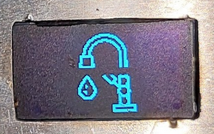
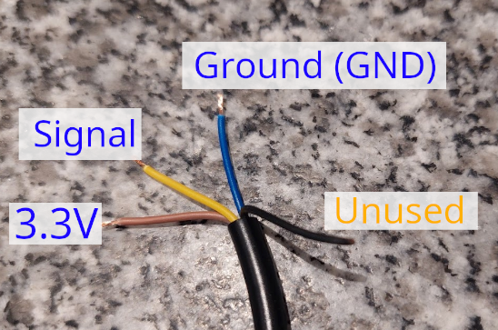
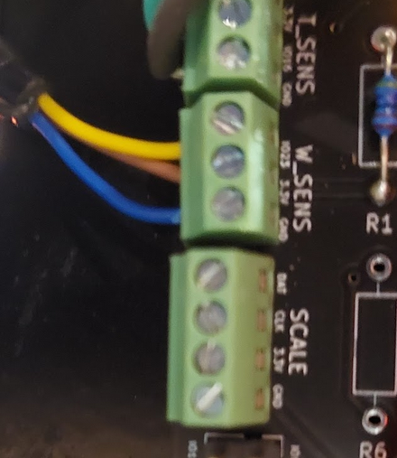
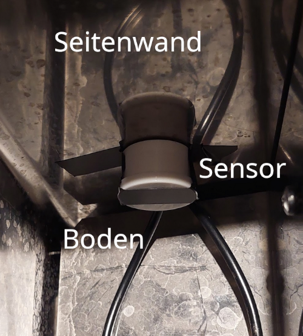
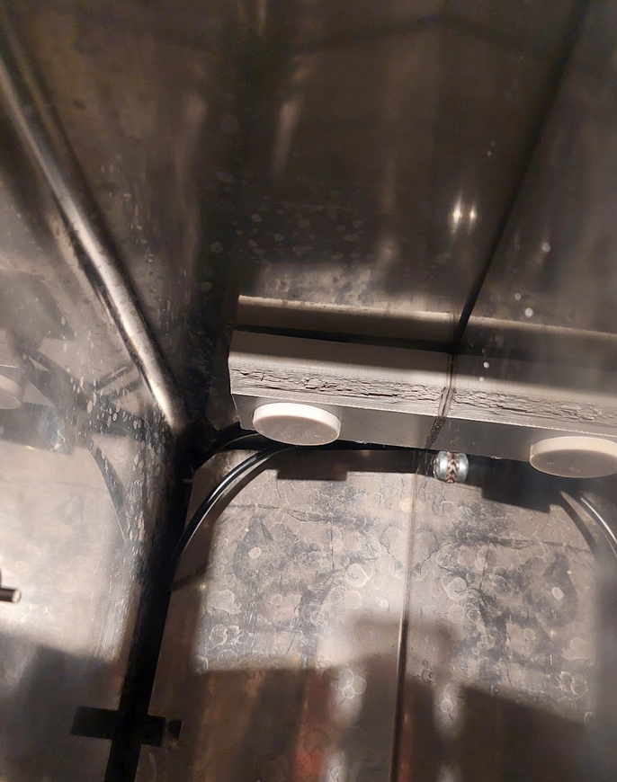

# Installation of a Water Level Sensor

{: .no_toc }

Table of Contents

- TOC
  {:toc}

## Introduction

Starting from version 4.0.0, the installation of a water level sensor is supported, which can detect the water level in the machine's plastic tank. It does not measure the remaining amount of water, but rather whether there is water at the installation height of the sensor ("yes") or not ("no").

Currently, two types of sensors are supported by the software as standard:

- [Xkx-Y25-Npn](https://www.amazon.de/Xkc-Y25-Npn-Fl%C3%BCssigkeitsstandsensor-Ber%C3%BChrungsloser-Wasserstandsmelder-Ausgangsschnittstelle/dp/B088PGKPJ4)
- [Xkx-Y25-Pnp](https://www.amazon.de/Wasserdichter-ber%C3%BChrungsloser-Fl%C3%BCssigkeitsstandssensor-Schalter-Signalausgang/dp/B074NVLTW6)

If the water level in the tank is too low (==below the installation height of the sensor), no espresso extraction or other action (e.g., steam) can be started. However, a running action will not be interrupted.



## Installation

**The following installation instructions describe the installation in a Rancilio Silvia. For other models, it should be checked beforehand whether installation on the tank is possible.**

The installation is very simple and does not require any additional soldering work. For installation, a 3D-printed bracket (see [here](https://www.thingiverse.com/thing:6340201)) can be used. Alternatively, the sensor can also be directly glued to the housing with (double-sided) adhesive tape.

### Preparation

Cut the connector plug from the sensor and strip the yellow, brown, and blue wires. The black wire is not used and can be taped to the cable with insulating tape.

### Connection

The wires have the following functions:

- Yellow: Signal (depending on PCB revision, e.g., V1.5 Pin 1023)
- Blue: Ground (GND)
- Brown: Power supply (3.3V)



On the PCB, connect the water level sensor to **W_SENS** as described.



### Placement of the Sensor

The sensor has a range of about 20mm (manufacturer's specification), meaning it should be placed as close as possible to the water tank. For the Rancilio Silvia, the sensor works when simply glued to the side wall.

The **installation height** of the sensor should be chosen so that there is still enough water in the tank at the time of the water level warning to finish a possibly running espresso extraction.




### Configuration in the Firmware

The sensor needs to be activated in the firmware. For this, search for and adjust the following entries in the file `userConfig.h`:

```c
// PID & Hardware
...
#define FEATURE_WATER_SENS 1       // 0 = deactivated, 1 = activated
#define WATER_SENS_TYPE 0          // 0 = water sensor XKC-Y25-NPN connected, 1 = XKC-Y25-PNP connected
```

**Important**: Set the value for `WATER_SENS_TYPE` to the correct value for the used sensor type (NPN or PNP).

Afterward, flash the firmware to the ESP ("Upload"), and the water level sensor should work.

## Troubleshooting

If there are issues with the sensor, test the connected and activated sensor "manually": Hold it directly against the filled tank (or another plastic container with water) and check if the correct state is displayed on the screen.

1. Tank contains water: Normal display / machine heats
2. Tank contains no water: Display shows "water faucet" symbol and machine does not heat.

If this does not work, check the connections on the PCB as well as the configuration in the software.

If the manual test works, the installation location of the sensor may be incorrect, and the sensor may need to be mounted closer to the tank wall.
