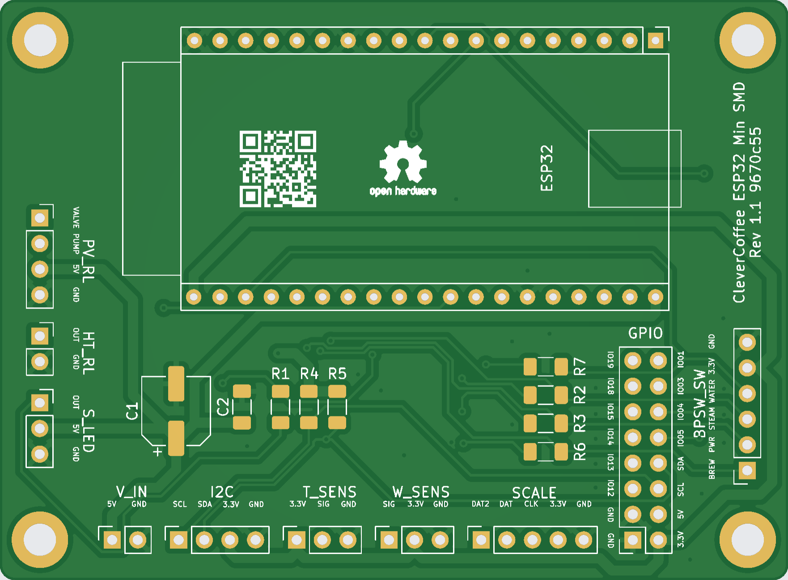
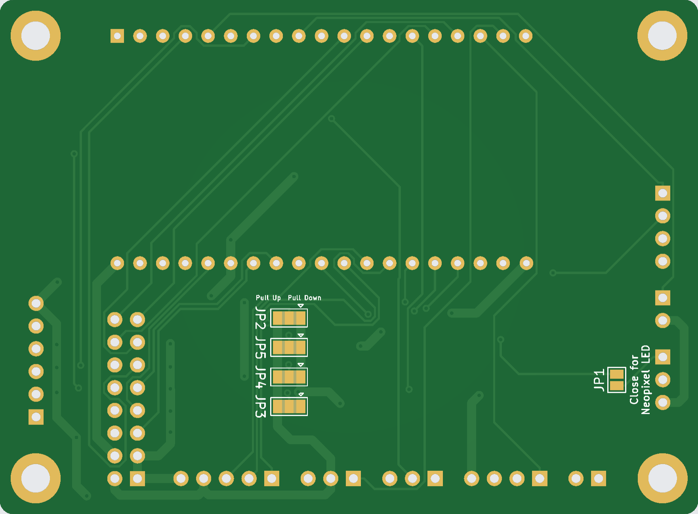

{: .no_toc }

Contents

* TOC
{:toc}

# ESP32 Minimal SMD PCB

We have transitioned from purely THT boards to combined SMD/THT boards. 
Resistors and capacitors are now implemented as SMD components, enabling flexible partial assembly. 
Here you can find information about the following revisions: 1.1 
For each revision, the respective section contains information about known bugs, pin layout, features, and more.

## Revision 1.1

KiCAD and Gerber files are available in our hardware repository:
[Minimal Rev 1.1](https://github.com/rancilio-pid/clevercoffee-hardware/releases/tag/Minimal_SMD_1.1)

### Bugs
Currently, there are no known bugs.

### Connections on the ESP32 Minimal SMD PCB Rev 1.1

Header | Pin Software | Pin PCB | Connection
-|-|-|-
HT_RL | PIN 2 | OUT | SSR Heating
T_SENS | PIN 16 | SIG | Temperature sensor
I2C | PIN 21 | SDA | Display and pressure sensor - Pin SDA
I2C | PIN 22 | SCL | Display and pressure sensor - Pin SCL
V_IN | - | 5V | Switching power supply (5 Volt)
PV_RL | PIN 17 | Valve | Relay 3-way-valve
PV_RL | PIN 27 | Pump | Relay pump
BPSW_SW | PIN 34 | BREW | Brew switch or optocoupler
BPSW_SW | PIN 39 | PWR | Power switch
BPSW_SW | PIN 35 | STEAM | Steam switch
BPSW_SW | PIN 36 | WATER | Hot water switch (not yet implemented)
S_LED | PIN 26 | OUT | Status or Temp LED
W_SENS | PIN 23 | SIG | Water level sensor
SCALE | PIN 25 | DAT2 | Scale DAT2
SCALE | PIN 32 | DAT | Scale DAT
SCALE | PIN 33 | CLK | Scale CLK
GPIO | PIN 1 | IO01 | Reserved for later use, e.g. Brew switch LED
GPIO | PIN 3 | IO03 | Reserved for later use, e.g. Rotary encoder CLK
GPIO | PIN 4 | IO04 | Reserved for later use, e.g. Rotary encoder DT
GPIO | PIN 5 | IO05 | Reserved for later use, e.g. Rotary encoder SW
GPIO | PIN 21 | SDA | Reserved for later use, e.g. IO Expander
GPIO | PIN 22 | SCL | Reserved for later use, e.g. IO Expander
GPIO | PIN 12 | IO12 | JTAG Debugger TDI
GPIO | PIN 13 | IO13 | JTAG Debugger TCK
GPIO | PIN 14 | IO14 | JTAG Debugger TMS
GPIO | PIN 15 | IO15 | JTAG Debugger TDO
GPIO | PIN 18 | IO18 | Reserved for later use, e.g. Dimmer ZC
GPIO | PIN 19 | IO19 | Reserved for later use, e.g. Steam switch LED

## Placement and Function

All required parts and their function are listed here:

Inscription PCB | Part | Function
-|-|-
C1 | Electrical capacitor 220 µF | Stabilization of power supply
C2 | Ceramic capacitor 100 nF | Stabilization of power supply
R1 | Resistor 220 Ω | Resistor Status LED
R2 | Resistor 47 kΩ | Pull down/up steam switch
R3 | Resistor 47 kΩ | Pull down/up power switch
R4 | Resistor 4,7 kΩ | Pull up i2C
R5 | Resistor 4,7 kΩ | Pull up i2C
R6 | Resistor 47 kΩ | Pull down/up brew switch or optocoupler
R7 | Resistor 47 kΩ | Pull down/up hot water switch
JP1 | Solder jumper | Resistor bypass for LED when using WS1812 LED
JP2 | Solder jumper | Pull down or Pull up for hot water switch
JP3 | Solder jumper | Pull down or Pull up for brew switch or optocoupler
JP4 | Solder jumper | Pull down or Pull up for power switch
JP5 | Solder jumper | Pull down or Pull up for steam switch

### Jumper Settings

The solder jumpers allow switching the resistors for the hot water, brew, power, and steam switches between pull-down and pull-up.
The resistors define the state of the switch input when the switch is not actuated.
The default configuration is that all jumpers are soldered to pull-down.
When using an optocoupler for brew detection, in most cases solder jumper JP3 must be configured as pull-up.

### Changes to Minimal THT Rev 1.6

- Resistors and capacitors implemented as SMD components
- Pull resistors for brew, hot water, steam, and power implemented via solder jumpers 

