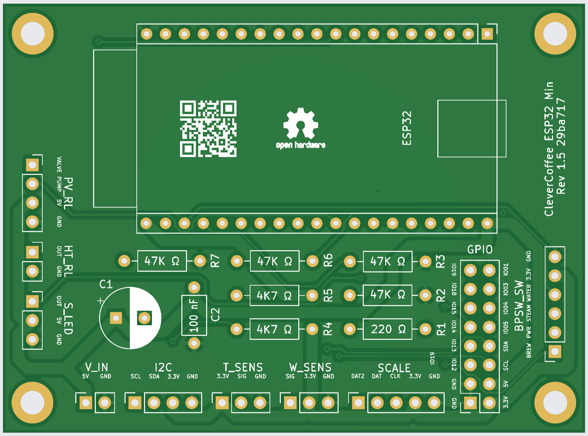
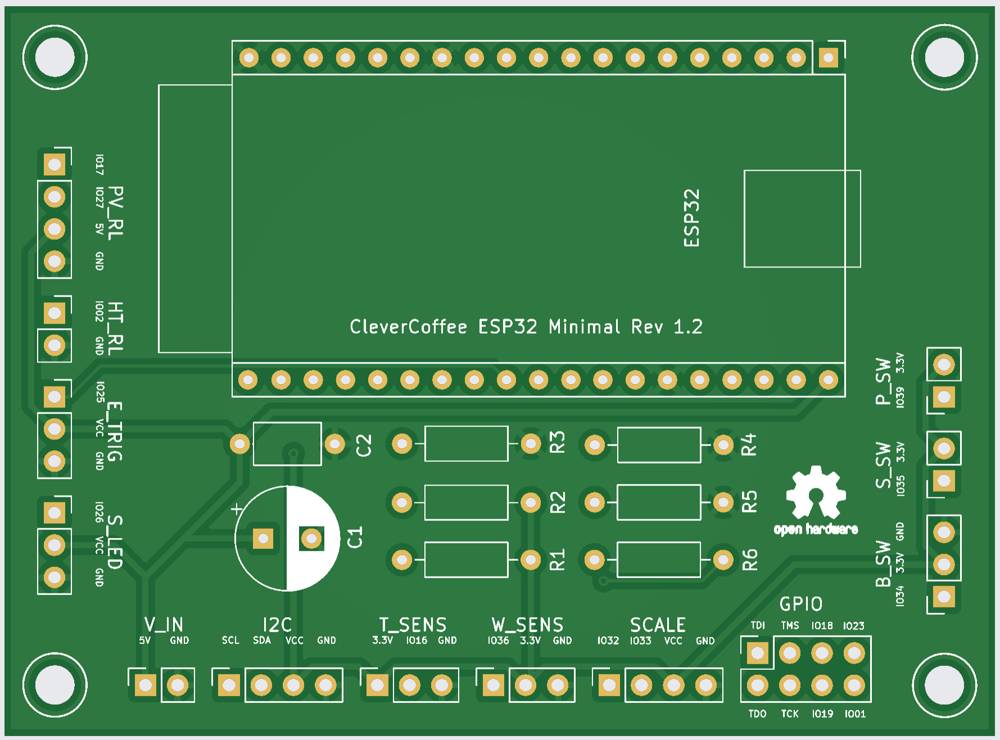

{: .no_toc }

Contents

* TOC
{:toc}

# ESP32 PCB

Several different revisions of our PCB are in use by now. 
Here you can find information about the following revisions: 1.2, 1.3, 1.5. and 1.6 
For each revision, the respective section contains information about known bugs, pin layout, features, and more.

## Revision 1.6

KiCAD and Gerber files are available in our hardware repository:
[Minimal Rev 1.6](https://github.com/rancilio-pid/clevercoffee-hardware/releases/tag/Minimal_1.6)

### Bugs
Currently, there are no known bugs.

### Connections on the ESP32 PCB Rev 1.6

Header | Pin Software | Pin PCB | Connection
-|-|-|-
HT_RL | PIN 2 | OUT | SSR Heating
T_SENS | PIN 16 | SIG | Temperature sensor
I2C | PIN 21 | SDA | Display and pressure sensor - Pin SDA
I2C | PIN 22 | SCL | Display and pressure sensor - Pin SCL
V_IN | - | 5V | Switching power supply (5 Volt)
PV_RL | PIN 17 | Valve | Relay 3-way-valve
PV_RL | PIN 27 | Pump | Relay pump
BPSW_SW | PIN 34 | BREW | Brew switch or optocoupler
BPSW_SW | PIN 39 | PWR | Power switch
BPSW_SW | PIN 35 | STEAM | Steam switch
BPSW_SW | PIN 39 | WATER | Hot water switch (not yet implemented)
S_LED | PIN 26 | OUT | Status or Temp LED
W_SENS | PIN 23 | SIG | Water level sensor
SCALE | PIN 25 | DAT2 | Scale DAT2
SCALE | PIN 32 | DAT | Scale DAT
SCALE | PIN 33 | CLK | Scale CLK
GPIO | PIN 1 | IO01 | Reserved for later use, e.g. Brew switch LED
GPIO | PIN 3 | IO03 | Reserved for later use, e.g. Rotary encoder CLK
GPIO | PIN 4 | IO04 | Reserved for later use, e.g. Rotary encoder DT
GPIO | PIN 5 | IO05 | Reserved for later use, e.g. Rotary encoder SW
GPIO | PIN 21 | SDA | Reserved for later use, e.g. IO Expander
GPIO | PIN 22 | SCL | Reserved for later use, e.g. IO Expander
GPIO | PIN 12 | IO12 | JTAG Debugger TDI
GPIO | PIN 13 | IO13 | JTAG Debugger TCK
GPIO | PIN 14 | IO14 | JTAG Debugger TMS
GPIO | PIN 15 | IO15 | JTAG Debugger TDO
GPIO | PIN 18 | IO18 | Reserved for later use, e.g. Dimmer ZC
GPIO | PIN 19 | IO19 | Reserved for later use, e.g. Steam switch LED

## Placement and Function

All required parts and their function are listed here:

Inscription PCB | Part | Function
-|-|-
C1 | Electrical capacitor 220 µF | Stabilization of power supply
C2 | Ceramic capacitor 100 nF | Stabilization of power supply
R1 | Resistor 220 Ω | Resistor Status LED
R2 | Resistor 47 kΩ | Pull down/up steam switch
R3 | Resistor 47 kΩ | Pull down/up power switch
R4 | Resistor 4,7 kΩ | Pull up i2C
R5 | Resistor 4,7 kΩ | Pull up i2C
R6 | Resistor 47 kΩ | Pull down/up brew switch or optocoupler
R7 | Resistor 47 kΩ | Pull down/up hot water switch
JP1 | Solder jumper | Resistor bypass for LED when using WS1812 LED
JP2 | Jumper | Pull down or Pull up for hot water switch
JP3 | Jumper | Pull down or Pull up for brew switch or optocoupler
JP4 | Jumper | Pull down or Pull up for power switch
JP5 | Jumper | Pull down or Pull up for steam switch

## Revision 1.5

KiCAD and Gerber files are available in our hardware repository:
[Minimal Rev 1.5](https://github.com/rancilio-pid/clevercoffee-hardware/releases/tag/Minimal_1.5)

### Bugs
Currently, there are no known bugs.

### Connections on the ESP32 PCB Rev 1.5

Header | Pin Software | Pin PCB | Connection
-|-|-|-
HT_RL | PIN 2 | OUT | SSR Heating
T_SENS | PIN 16 | SIG | Temperature sensor
I2C | PIN 21 | SDA | Display and pressure sensor - Pin SDA
I2C | PIN 22 | SCL | Display and pressure sensor - Pin SCL
V_IN | - | 5V | Switching power supply (5 Volt)
PV_RL | PIN 17 | Valve | Relay 3-way-valve
PV_RL | PIN 27 | Pump | Relay pump
BPSW_SW | PIN 34 | BREW | Brew switch or optocoupler
BPSW_SW | PIN 39 | PWR | Power switch
BPSW_SW | PIN 35 | STEAM | Steam switch
BPSW_SW | PIN 39 | WATER | Hot water switch (not yet implemented)
S_LED | PIN 26 | OUT | Status LED
W_SENS | PIN 23 | SIG | Water level sensor
SCALE | PIN 25 | DAT2 | Scale DAT2
SCALE | PIN 32 | DAT | Scale DAT
SCALE | PIN 33 | CLK | Scale CLK
GPIO | PIN 1 | IO01 | Reserved for later use, e.g. Brew switch LED
GPIO | PIN 3 | IO03 | Reserved for later use, e.g. Rotary encoder CLK
GPIO | PIN 4 | IO04 | Reserved for later use, e.g. Rotary encoder DT
GPIO | PIN 5 | IO05 | Reserved for later use, e.g. Rotary encoder SW
GPIO | PIN 21 | SDA | Reserved for later use, e.g. IO Expander
GPIO | PIN 22 | SCL | Reserved for later use, e.g. IO Expander
GPIO | PIN 12 | IO12 | JTAG Debugger TDI
GPIO | PIN 13 | IO13 | JTAG Debugger TCK
GPIO | PIN 14 | IO14 | JTAG Debugger TMS
GPIO | PIN 15 | IO15 | JTAG Debugger TDO
GPIO | PIN 18 | IO18 | Reserved for later use, e.g. Dimmer ZC
GPIO | PIN 19 | IO19 | Reserved for later use, e.g. Steam switch LED

## Placement and Function

All required parts and their function are listed here:

Inscription PCB | Part | Function
-|-|-
C1 | Electrical capacitor 220 µF | Stabilization of power supply
C2 | Ceramic capacitor 100 nF | Stabilization of power supply
R1 | Resistor 220 Ω | Resistor Status LED
R2 | Resistor 47 kΩ | Pull down steam switch
R3 | Resistor 47 kΩ | Pull down power switch
R4 | Resistor 4,7 kΩ | Pull up i2C
R5 | Resistor 4,7 kΩ | Pull up i2C
R6 | Resistor 47 kΩ | Pull down/up brew switch or optocoupler
R7 | Resistor 47 kΩ | Pull down hot water switch
JP1 | Solder jumper | Resistor bypass for LED when using WS1812 LED
JP2 | Solder jumper | Pull down or Pull up for brew switch or optocoupler

## Revision 1.3

KiCAD and Gerber files are available in our hardware repository:
[Minimal Rev 1.3](https://github.com/rancilio-pid/clevercoffee-hardware/releases/tag/Minimal_1.3)

### Bugs

Faulty optocoupler for brew detection:

* Only compatible with high level trigger optocoupler
* Workaround for low level trigger: Don't solder pulldown resistor `R3`, and depending on software version, set the following:
  * MASTER -> `OPTOCOUPLER_TYPE` to `LOW`
  * 3.3.0 and older -> `PINMODEVOLTAGESENSOR` to `INPUT_PULLUP` and `VOLTAGESENSOR` to `LOW`
* Missing GPIO: IO03, IO04, IO05

### Connections on the ESP32 PCB Rev 1.3

Header | Pin Software | Pin PCB | Connection
-|-|-|-
HT_RL | PIN 2 | IO02 | SSR Heating
T_SENS | PIN 16 | IO16 | Temperature sensor
I2C | PIN 21 | SDA | Display and pressure sensor - PIN SDA
I2C | PIN 22 | SDL | Display and pressure sensor - PIN SCL
V_IN | - | V_IN | Switching power supply (5 Volt)
PV_RL | PIN 17 | Valve | Relay 3-way-valve
PV_RL | PIN 27 | Pump | Relay pump
B_SW | PIN 34 | IO34 | Brew switch or optocoupler
S_SW | PIN 35 | IO35 | Steam switch
P_SW | PIN 39 | IO39 | Power switch
E_TRIG | PIN 25 | IO25 | Trigger Silvia E CPU **Up to s/w version 3.X, afterwards `SCALE DAT2`**
S_LED | PIN 26 | IO26 | Status LED
W_SENS | PIN 23 | IO23 | Water level sensor
SCALE | PIN 32 | DAT | Scale DAT
SCALE | PIN 33 | CLK | Scale CLK
GPIO | PIN 1 | IO01 | Reserved for later use, e.g. Brew switch LED
GPIO | PIN 12 | IO12 | JTAG Debugger TDI
GPIO | PIN 13 | IO13 | JTAG Debugger TCK
GPIO | PIN 14 | IO14 | JTAG Debugger TMS
GPIO | PIN 15 | IO15 | JTAG Debugger TDO
GPIO | PIN 18 | IO18 | Reserved for later use, e.g. Dimmer ZC
GPIO | PIN 19 | IO19 | Reserved for later use, e.g. Steam switch LED
GPIO | PIN 36 | IO36 | Hot water switch (not yet implemented)

## Placement and Function

All required parts and their function are listed here:

Inscription PCB | Part | Function
-|-|-
C1 | Electrical capacitor 220 µF | Stabilization of power supply
C2 | Ceramic capacitor 100 nF | Stabilization of power supply
R1 | Resistor 4,7 kΩ | Pull up i2C
R2 | Resistor 4,7 kΩ | Pull up i2C
R3 | Resistor 47 kΩ | Pull down brew switch
R4 | Resistor 47 kΩ | Pull down power switch
R5 | Resistor 47 kΩ | Pull down steam switch
R6 | Resistor 220 Ω | Resistor Status LED
JP1 | Solder jumper | Resistor bypass for LED when using WS1812 LED

## Revision 1.2

KiCAD and Gerber files are available in our hardware repository:
[Minimal Rev 1.2](https://github.com/rancilio-pid/clevercoffee-hardware/releases/tag/Minimal_1.2)

### Bugs

Errors in PCB inscription:
HEADER | PCB Inscription | Correct Inscription
-|-|-
S_LED | VCC | 5V
E_TRIG | VCC | 5V
W_SENS | IO36 | IO23
GPIO | IO23 | IO36

Faulty optocoupler for brew detection:

* Only compatible with high level trigger optocoupler
* Workaround for low level trigger: Don't solder pulldown resistor `R3`, and depending on software version, set the following:
  * MASTER -> `OPTOCOUPLER_TYPE` to `LOW`
  * 3.3.0 and older -> `PINMODEVOLTAGESENSOR` to `INPUT_PULLUP` and `VOLTAGESENSOR` to `LOW`
* Missing GPIO: IO03, IO04, IO05

### Connectors of the ESP32 PCB Rev 1.2

Header | PIN Software | PIN PCB | Connection
-|-|-|-
HT_RL | PIN 2 | IO02 | SSR Heating
T_SENS | PIN 16 | IO16 | Temperature sensor
I2C | PIN 21 | SDA | Display and pressure sensor - PIN SDA
I2C | PIN 22 | SDL | Display and pressure sensor - PIN SCL
V_IN | - | V_IN | Switching power supply (5 Volt)
PV_RL | PIN 17 | Valve | Relay 3-way-valve
PV_RL | PIN 27 | Pump | Relay pump
B_SW | PIN 34 | IO34 | Brew switch or optocoupler
S_SW | PIN 35 | IO35 | Steam switch
P_SW | PIN 39 | IO39 | Power switch
E_TRIG | PIN 25 | IO25 | Trigger Silvia E CPU **Up to s/w version 3.X, afterwards `SCALE DAT2`**
S_LED | PIN 26 | IO26 | Status LED
W_SENS | PIN 23 | IO23 | Water level sensor
SCALE | PIN 32 | DAT | Scale DAT
SCALE | PIN 33 | CLK | Scale CLK
GPIO | PIN 1 | IO01 | Reserved for later use, e.g. Brew switch LED
GPIO | PIN 12 | IO12 | JTAG Debugger TDI
GPIO | PIN 13 | IO13 | JTAG Debugger TCK
GPIO | PIN 14 | IO14 | JTAG Debugger TMS
GPIO | PIN 15 | IO15 | JTAG Debugger TDO
GPIO | PIN 18 | IO18 | Reserved for later use, e.g. Dimmer ZC
GPIO | PIN 19 | IO19 | Reserved for later use, e.g. Steam switch LED
GPIO | PIN 36 | IO36 | Hot water switch (not yet implemented)

## Placement and Function

All required parts and their function are listed here:

Inscription PCB | Part | Function
-|-|-
C1 | Electrical capacitor 220 µF | Stabilization of power supply
C2 | Ceramic capacitor 100 nF | Stabilization of power supply
R1 | Resistor 4,7 kΩ | Pull up i2C
R2 | Resistor 4,7 kΩ | Pull up i2C
R3 | Resistor 47 kΩ | Pull down brew switch
R4 | Resistor 47 kΩ | Pull down power switch
R5 | Resistor 47 kΩ | Pull down steam switch
R6 | Resistor 220 Ω | Resistor Status LED
JP1 | Solder jumper | Resistor bypass for LED when using WS1812 LED
