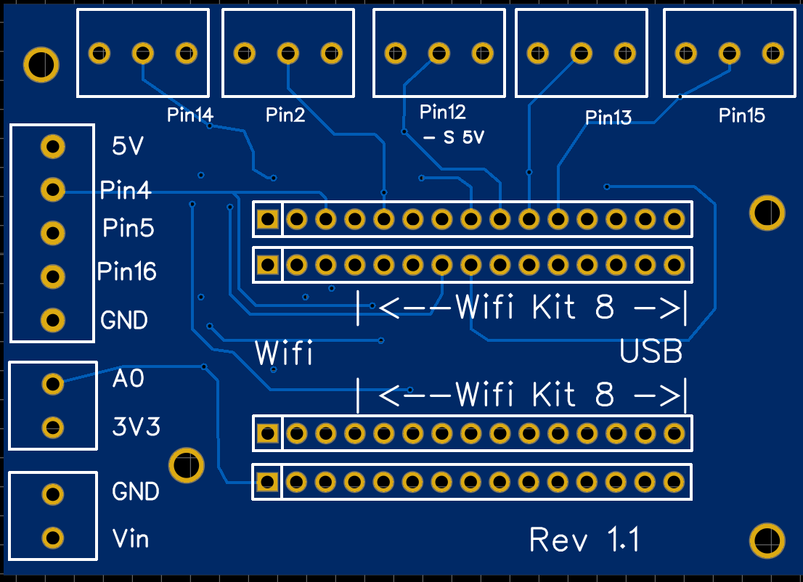

{: .no_toc }

Contents

* TOC
{:toc}

## ESP8266 PCB

The PCB for the (older) microcontroller ESP8266 looks like this:

### Pin Layout of PCB ESP8266

The different components are connected as follows:

Pin | Function
-|-
Pin 15 | Brew switch or optocoupler
Pin 14 | SSR Heating
Pin 2 | Temperature sensor
A0 | Pressure sensor
Pin 4 | Display SDA
Pin 5 | Display SCL
Pin 16 | E-Trigger Standby Trigger for Silvia E

### Full Expansion

For the full expansion the relays for the 3-way-valve and pump are required:

PIN | function
-|-
PIN 12 | Relay 3-way-valve
PIN 13 | Relay pump
