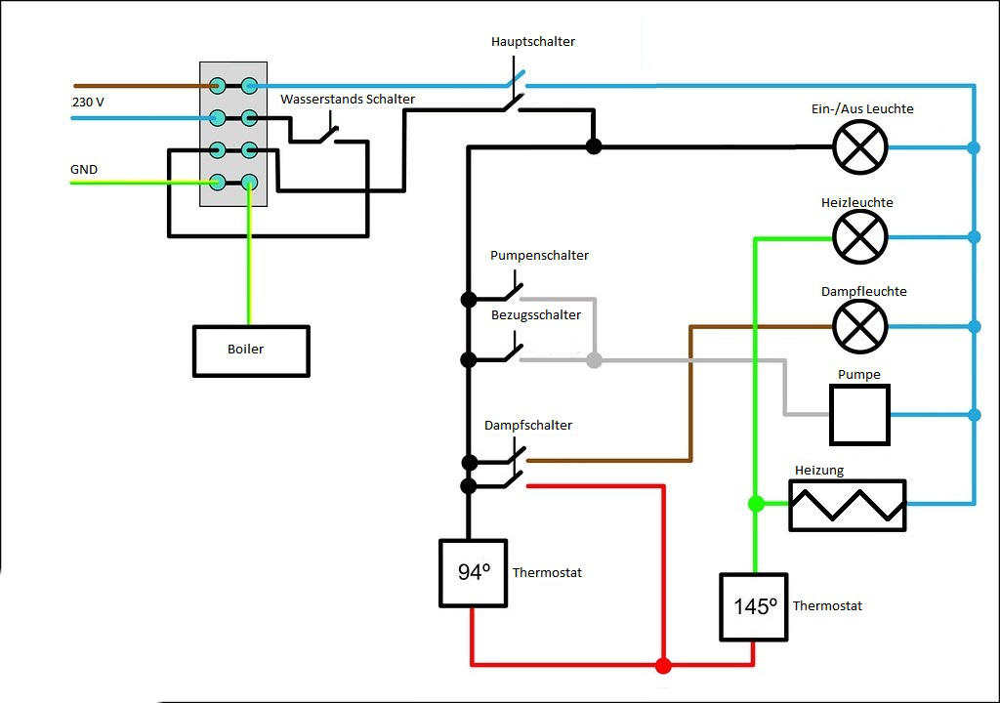

# PID Umbau Isomac Zaffiro von Frank


## Author

Dieser Baubericht ist von Frank, Discord @frank0114

##  Einleitung

Meine Isomac Zaffiro begleitet mich jetzt schon über 17 Jahre. Ich habe sie damals als defekt erworben, erstmal total zerlegt, entkalkt und wieder zusammengebaut. So haben wir uns kennengelernt. Dann hat sie mir viele Jahre lang hervorragenden Espresso beschert, zumindest dachte ich das, bis ich letztes Jahr anfing mich etwas intensiver mit Kaffee zu beschäftigen. Es folgten dann logischerweise eine neue Mühle und ein kleines unscheinbares Thermometer für die E61 Brühgruppe. Dann
ging es los. Erst montierte ich den Thermostat-Regler der innerhalb der Maschine verbaut ist nach außen, damit ich etwas mehr Kontrolle über die Temperatur bekomme, und verpasste dem Thermofühler noch etwas Wärmeleitpaste. Da die Maschine nun schonmal offen war bekam sie sogleich noch Alubutylmatten auf alle Flächen verpasst, und, was mit Abstand am meisten brachte in Punkto Schalldämpfung, ein Membranventil, wie es auch in der Quickmill Orione verbaut ist.

Zurück zur Temperatur. Dieses kleine Thermometer zeigte mir leider, oder Gottseidank, dass es mit der Temperaturkonstanz der Zaffiro nicht so gut lief, wie ich das gerne hätte. Von nun an begann also das berühmte Temperatursurfen um im richtigen Moment den Bezug zu starten, damit dann auch bei der gewünschten Temperatur gebrüht wird. - Jaa..., das kann man machen, auf Dauer nervt es aber.

Lange habe ich dann hin und her überlegt, PID Umbau, neue Maschine, wenn Umbau, welcher?

Letztendlich ist es der DIY Umbau von [CleverCoffee](https://clevercoffe.de) geworden über den man zwangsläufig irgendwann mal stolpert, wenn man sich ernsthafter mit der Materie beschäftigt.

## Vorbereitung

Bevor man mit dem Umbau startet bedarf es einiger Vorbereitungen und Überlegungen. Zuerst einmal muss man sich das Ganze zutrauen, denn es wird einem nicht Mundgerecht serviert sondern ist ein, je nach Vorwissen und Geschicklichkeit, anspruchsvolles Unterfangen. Folgende Herausforderungen stellen sich einem:\
• Arbeiten am offenen Gerät und mit Netzspannung 230 V\
• Bestücken einer Platine und weitere Lötarbeiten\
• Installieren der Software\
• Testlauf mit Interpretation und Anpassung der PID Parameter auf eine bisher unbekannte Maschine\
• Erstellen eines 3D gedruckten Gehäuses für das Display\
• Einbau und Fertigstellung nach erfolgreicher Probelaufzeit

Was man sonst noch braucht:\
• Lötkolben oder Lötstation mit feiner Spitze\
• Seitenschneider\
• Schrumpfschlauch in diversen Größen\
• Terminal Verbinder und Crimpzange\
• Kabelbinder\
• Wärmeleitpaste für den TSIC\
• Wärmeleitkleber für das SSR (optional)\
• Spiegelklebeband\
• Schaltplan der Maschine



**Schaltplan ohne PID**

## Umsetzung


**Erster Trockenaufbau**

Nachdem man sich die Einzelteile nach der Bestellliste besorgt hat, kann es losgehen. Das PCB wird mit den Stiftleisten für das ESP bestückt, mit den Klemmterminals und den Kondensatoren und Widerständen. Ich war hier gleich etwas voreilig und musste den Widerstand R3 (47kOhm) wieder entfernen, da sonst der Optokoppler für die Brüherkennung nicht funktioniert. Ich habe mir dann auch noch einen anderen ESP32, mit externer WLAN Antenne besorgt, da der aus der Bestellliste vermutlich im inneren des Edelstahlgehäuses der Maschine keinen Empfang gehabt hätte.


Sobald das PCB bestückt ist und der TSIC verkabelt, kann man das Ganze erstmal mit ausreichend Überlänge der Kabel provisorisch zusammenbauen.
Auf dem Foto oben sieht man den Zusammenbau, das war bei mir zu dem Zeitpunkt noch die Variante ohne Brüherkennung. Ich kann nur empfehlen diese gleich mit einzuplanen, ich hatte erst später bemerkt, dass sie doch sinnvoll ist.

Als nächstes muss die Software auf das ESP. Für mich war das der schwierigste Teil. Das lag vor allem daran, dass mir die Software Visual Studio Code fremd war und der Umgang damit nicht unbedingt selbsterklärend ist. Ich hatte hierbei viel Hilfe vom Support nötig, aber letztendlich hat auch das Funktioniert. Nochmals vielen Dank für die Geduld.

Ich möchte die Vorgehensweise darum auch gar nicht weiter erklären und verlinke nur das sehr detaillierte Manual und die Supportseite:  
> [Softwareinstallation](https://manual.rancilio-pid.de/de/software-part-I/programmcode.html)
> [CleverCoffee Support](https://discord.gg/MwdS2XnJsK)

Eine Wichtige Datei möchte ich dennoch erwähnen, die man in VS-Code
auf seine Ausbaustufe, bzw. seine Hardware anpassen muss, die
userConfig.h. Folgende Voreinstellungen habe ich dabei für meinen
Umbau vorgenommen: 
``` 
#define DISPLAYTEMPLATE 3
#define SHOTTIMER 1
#define ONLYPID 1
#define BREWDETECTION 3
#define BREWSWITCHTYPE 0
#define VOLTAGESENSORTYPE LOW
#define PINMODEVOLTAGESENSOR INPUT_PULLUP
```

Alle anderen Werte habe ich gelassen wie sie waren. Da aber immer mal wieder Updates geliefert werden, bitte einmal komplett durchsehen und bei Bedarf im Support fragen.

Nach erfolgreichem flashen des ESP kann man den Trockenaufbau nochmals testen bevor es an den Einbau geht. Das Webinterface des ESP erreicht man über die IP-Adresse oder durch Eingabe von silvia.local im Browser.

  

**Schaltplan mit PID**

## Einbau
  

**Einbau (noch ohne Steam-Switch)** 

Die Isomac Zaffiro bietet eigentlich genügend Platz, um alle Komponenten im inneren Unterzubringen. Meine Lösung ist auf dem Bild links zu erkennen und ergab sich aus folgenden Überlegungen. Das ESP sollte möglichst abseits der großen Wärmequelle Boiler platziert werden, daher fand es unter dem Wassertank Platz. Den Sensor (TSIC) habe ich mit einer 80 mm Schlauchschelle und etwas Wärmeleitpaste am Kessel festgeklemmt. Hierzu lässt sich noch anmerken, dass ich verschiedene Positionen ausprobiert hatte und letztendlich der Messpunkt etwa auf Höhe des Abzweigs zur Brühgruppe die besten Ergebnisse lieferte. Das SSR habe ich am Boden neben dem Boiler befestigt. Ebenso unter den Wassertank wanderten noch das Netzteil, sowie der Optokoppler, der zusätzlich noch in einer kurzen PVC Röhre verschwand wegen der unter 230V stehenden Lötanschlüsse auf der Unterseite der Platine. Das PCB kam ja bereits mit Klebepads, für das SSR habe ich Wärmeleitkleber verwendet und für alles andere Spiegelklebeband. 
Da ich aus einem vorherigen Umbau bereits drei Löcher in der Frontplatte hatte, um den Thermostatregler von außen zugänglich zu haben, habe ich diese kurzerhand für das Display genutzt, und dieses in einem selbstgedruckten Gehäuse aus ABS untergebracht . 
Im Schaltplan oben sieht man die Anschlüsse. Strom fürs Netzteil habe ich mir an der Ein-/Aus-Leuchte geholt, weil man dort am besten dran kommt. 

  

**Hier gibt es 230V fürs Netzteil**

Die beiden Kabel vom nun nicht mehr benötigten Thermostat Regler habe ich am SSR angeschlossen, und von den beiden Pumpenanschlüssen habe ich mir zwei Kabel zum Optokoppler für die Brüherkennung gezogen.

  

**Die beiden Kabel (orange & schwarz) werden nun vom SSR geschaltet**

  

**Hier kommt der Optokoppler mit dran**

  

**Der Optokoppler versteckt sich in der PVC Röhre, 
der Dampfschalter ist noch nicht angeschlossen**

  

**So wird der Optokoppler richtig verkabelt**

Der Dampfschalter hat zwei Schaltebenen. Eine schaltet die Leuchte, die bleibt unberührt, die andere Seite Schaltet den Dampfthermoatat, diese wird abgezogen und nicht mehr benötigt (Steckerenden isolieren!) Nun können die frei gewordenen Anschlüsse des Schalter direkt mit dem PCB Verbunden werden (S_SW).

  

**Eine Seite des Dampfschalters wird mit dem PCB verbunden ( grün & gelb)**

  

**Die WLAN Antenne sitzt in einer kleinen Aussparung am Gehäuse, 
sodass es problemlos nach oben abgenommen werden kann.**

## PID Werte

Die von Clevercoffee voreingestellten Parameter im Webinterface, sind für die Zaffiro nicht geeignet. Durch die E61 Brühgruppe hat sie einen deutlich höheren Temperaturverlust als die Rancilio Silvia, von der die default Werte kommen. Das bedeutet, im Wesentlichen muss PID Kp und BD Kp erhöht werden sowie PID Integrator Max. Die Zusammenhänge der einzelnen Parameter sind sehr komplex, aber sehr gut beschrieben. Ich habe mir die Parameter durch Versuche und Vergleiche selbst ermittelt, die Maschine heizt nun sehr schnell hoch ( ca. 10 min) und nach einem Bezug ist sie innerhalb von zwei Minuten wieder auf Temperatur.

Verschiedene Kontrollmessungen mit einem Geisinger Brühgruppenthermometer sowie zur Verifikation einem externen Digitalthermometer, haben mir dennoch gezeigt, dass selbst 30 min Vorheizen bei einer E61 Maschine nicht ausreichend sind. Erst nach 45 min ist die Maschine soweit vorgewärmt, dass beim ersten Bezug die gewünschte Brühtemperatur erreicht wird. Und das trotz vorherigem Leerbezug.

  
